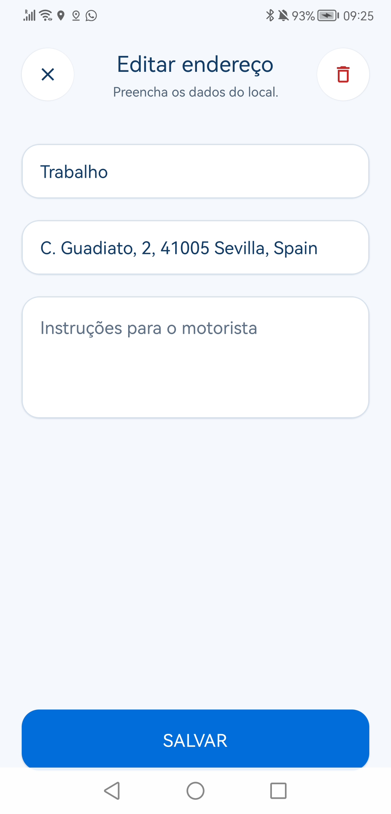
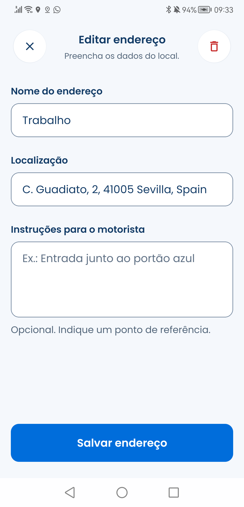

# Client design system implementation review

18 September 2026. Scope: client only. References inform the visual direction; their text is not a product instruction.

## Delivered standard

[Specification, exact token table, component contracts, layout, migration and exception rules](../CLIENT-DESIGN-SYSTEM.md). [Current source audit and inventory](../CONSISTENCY-AUDIT-2026-09-18.md). [Machine-readable tokens](../client-tokens.json).

## Applied in this pass

- Load bundled Poppins 400/500/600/700 before rendering product text. Previously the faces were imported but useFonts was never invoked.
- Shared AppButton now covers primary, secondary, neutral, destructive fill and destructive outline, icons, wrapping labels and pending state. Active towing uses it while retaining cancellation eligibility and callbacks.
- AppField supplies persistent labels, shared field geometry and hint/error text. Saved-address editing uses it with scrolling, keyboard avoidance, safe-area bottom padding and shared save behavior.
- ScalePressable now forwards accessibility props and caller press-in/out handlers; spring motion respects the system reduced-motion preference.
- Vehicle, insurance and contact forms/lists share field, action, card and 48-unit dismiss recipes. Vehicle fields use one column so long content does not collide.
- Registration placeholders and password-strength colors use semantic tokens; registration shadows use restrained shared elevation.
- Home cards use named dimensions. Home sheet fits content, caps its height to the viewport and reserves bottom clearance. Route labels flex and wrap. Scheduled-trip time uses the Poppins heading role instead of 38/36 typography.
- Country selection shares the field recipe and announces its expanded state; accessibility-modal controls use the common 48-unit target.
- AppHeader and AppIconButton now define one safe-area-aware header system with symmetric 48-unit controls. Twenty-seven modules use it across saved places, account lists/forms, registration, secondary navigation, notifications, trip details and booking modals.
- Saved-place create, edit and location-search keep the draft when returning from search and use the same header, labeled fields and actions as the rest of the account flow.
- The drawer uses the common type, color, spacing and selected-state tokens; every item, including logout, fits above the Android system navigation area on the review device.
- A repository audit command (`npm run design:audit`) rejects new raw colors, positive spacing, font sizes and radii outside the theme.

## Before and after: actual Android captures

Device: connected Huawei Android handset, native app, portrait, 1080 × 2244 screenshot pixels. Captures use the existing test account. Screenshot pixels are not design-token units. No records were saved, deleted or booked during review.

| Before: edit existing work address | After: same work address |
| --- | --- |
|  |  |

Before: system-font appearance, disappearing field labels, independently styled controls and save action against the navigation bar. After: Poppins hierarchy, persistent labels, common 12-radius fields, semantic borders, shared action and bottom clearance. Both show the existing work-address data.

Additional observed states: [empty address form](after.png), [focused input](keyboard.png), [saved-place list](saved-places.png), [home](home.png). The focused-input capture was taken during keyboard appearance; it establishes visible focus, not a complete keyboard traversal test.

Other before/after source examples:

| Area | Before this pass | After |
| --- | --- | --- |
| Towing | Three custom action recipes at 16 radius | AppButton semantic variants at 12 radius, common wrapping label and focus state |
| Vehicle/contact/insurance | Separate field/save recipes; 40-unit dismiss controls | Shared recipes, 48-unit dismissal, accessible labels |
| Registration | Pale #B0B0B0 placeholders and colored local shadows | textMuted and neutral shadows.sm |
| Home | Fixed half-screen panel could clip the search action | Content-sized panel with maximum height and bottom clearance |
| Scheduled details | 38 text / 36 line height | h1 Poppins semibold, 28 / 36 |

## Validation

- All 142 JavaScript source files parse with Babel using the project configuration.
- `npm run design:audit` passes across all 142 source files; ordinary colors, positive spacing, font sizes and radii resolve through tokens.
- A production Android export compiled all 2,327 modules successfully with Expo 57 and Node 24.
- All named imports from the theme resolve against its exports.
- Metro Android bundle request succeeded with HTTP 200; live updates rendered on the connected device.
- [Calculated contrast pairs](contrast.json): primary 4.99:1; navy 11.39:1; secondary 6.01:1; muted 5.00:1; error 5.62:1; warning 6.10:1; success 5.32:1 on white. Strong field boundary is 3.41:1. These checks exclude composited opacity states and map backgrounds.
- Observed home, drawer, saved-place list/create/edit/location search, Notifications empty state, Settings, Profile, Vehicles and new-vehicle form on the connected Android device. Scrollable actions remain reachable and existing data was not changed.
- The device log contains no React Native JavaScript error, reference error, type error, module-resolution error or syntax error after navigation through the reviewed flows.

## Remaining release checks and decisions

- Tablet/desktop architecture is provisional: references establish phone layouts only. Existing max-width tokens define the target; every legacy screen is not yet validated at those widths.
- Native maps do not provide a complete web preview. No claim of iOS, desktop keyboard, TalkBack, large-text or end-to-end booking/cancellation verification is made.
- Third-party dropdown/modal focus behavior, all reduced-motion entry animations and every legacy viewport-scaled illustration or map measurement still require platform-specific review. These measurements are not ordinary type, spacing, radius or color tokens.
- Existing service-detail support/review controls have no handlers in the inspected implementation. A product decision is required for their destinations; this visual migration does not invent behavior.

Use the specification checklist as a release gate. Static checks and one Android device do not certify the entire product as accessibility-complete.

## Migration completion pass — 18 September 2026 (later same day)

- `fontSize: typeScale.*` usage retired across every consumer: reading sizes and line heights now reference shared `typography` roles. Numeric `fontWeight` strings remain as documented input to `AppText` weight normalization; out-of-vocabulary weights (300/800/900) were normalized to 400/700. The `typeScale` alias was removed from the theme and the consumerless `src/styles.js` was deleted.
- `typography.hero` (32/40) was defined for the former hero usages; `sizes.iconXL` (32) covers large success glyphs. Icon glyphs were normalized to the 16/20/24/32 vocabulary and decorative icon chips to the 48-unit geometry; `componentStyles`-aligned fixes touched `userCarInfo` (field recipe, 56 primary confirm, 48 save-toggle target) and `placeSearch` (48 search pill with shared `shadows.md`).
- `npm run design:tokens` regenerates `client-tokens.json` from the theme for ios/android/web.
- Validation after the pass: all 141 source files parse; `design:audit` passes; import coverage and alias-removal checks pass; production Android export compiles (all modules, Expo 57, Node 24).
- Device verification on the connected Huawei (Metro dev bundle): home with saved places and location chip, drawer, History with filter tabs and amounts, trip details (route/vehicle/payment/identification sections), Profile labeled form and Notifications empty state all rendered; logcat showed no JavaScript error, reference error, type error or crash during these flows. Evidence captures: [home](../../../../qa/design-pass-2-home.png), [drawer](../../../../qa/design-pass-2-drawer.png), [history](../../../../qa/design-pass-2-history.png), [trip details](../../../../qa/design-pass-2-details.png), [profile](../../../../qa/design-pass-2-profile.png), [notifications](../../../../qa/design-pass-2-notifications.png).
